<div align="center">
  
</div>

<div align="center">
  
</div>

<div align="center">
  <a href="mailto:pavanmanikantabandi9951672843@gmail.com"></a>
  <a href="https://github.com/Bandi-maya?tab=repositories"></a>
  
</div>

<br />

<div align="center">
  
</div>

## `> whoami`

<table>
  <tr>
    <td width="58%" valign="top">
      <h3>Building complete digital products—not isolated screens.</h3>
      <p>
        I am a full-stack software developer focused on converting real product ideas into responsive, secure, and maintainable applications. My work spans modern React and Next.js interfaces, Python and Flask APIs, authentication, data modeling, and end-to-end application flows.
      </p>
      <p>
        I care about <strong>clear architecture</strong>, <strong>strong user experience</strong>, <strong>reliable backend systems</strong>, and code that another developer can understand without reverse-engineering it.
      </p>
    </td>
    <td width="42%" valign="top">
      <pre>
const developer = {
  name: "Pavan Bandi",
  frontend: "React / Next.js",
  backend: "Python / Flask",
  databases: ["PostgreSQL", "MongoDB"],
  mindset: "Design. Build. Ship. Improve."
};
      </pre>
    </td>
  </tr>
</table>

<div align="center">
  
  
  
</div>

<br />

## `> selected_work`

<table>
  <tr>
    <td width="50%" valign="top">
      <h3><a href="https://github.com/Bandi-maya/goatui">01 — GoatUI</a></h3>
      <p><strong>Component-driven frontend engineering</strong></p>
      <p>A modern Next.js application using React 19, TypeScript, Tailwind CSS, Framer Motion, Radix primitives, charts, reusable UI patterns, and automated build tooling.</p>
      <p>
        
        
        
      </p>
      <a href="https://github.com/Bandi-maya/goatui"></a>
    </td>
    <td width="50%" valign="top">
      <h3><a href="https://github.com/Bandi-maya/ecom">02 — E-Commerce Platform</a></h3>
      <p><strong>Full-stack commerce and account workflows</strong></p>
      <p>A Next.js commerce application integrating MongoDB, JWT authentication, React Query, email workflows, product experiences, motion, and server-backed application logic.</p>
      <p>
        
        
        
      </p>
      <a href="https://github.com/Bandi-maya/ecom"></a>
    </td>
  </tr>
  <tr>
    <td width="50%" valign="top">
      <h3><a href="https://github.com/Bandi-maya/hmsbackendnew">03 — Hospital Management API</a></h3>
      <p><strong>Secure backend and operational data flows</strong></p>
      <p>A Flask REST backend with JWT-based access control, SQLAlchemy persistence, database migrations, PostgreSQL support, validation, CORS, and email integration.</p>
      <p>
        
        
        
      </p>
      <a href="https://github.com/Bandi-maya/hmsbackendnew"></a>
    </td>
    <td width="50%" valign="top">
      <h3><a href="https://github.com/Bandi-maya/unisys-db-fe">04 — Data Interface</a></h3>
      <p><strong>Typed frontend for data-centric workflows</strong></p>
      <p>A modern Vite application built with React 19, TypeScript, React Router, Tailwind CSS, and a strict linting and build toolchain.</p>
      <p>
        
        
        
      </p>
      <a href="https://github.com/Bandi-maya/unisys-db-fe"></a>
    </td>
  </tr>
</table>

<div align="center">
  <a href="https://github.com/Bandi-maya?tab=repositories"></a>
</div>

<br />

## `> technology_stack`

<div align="center">
  
</div>

<br />

<table>
  <tr>
    <td align="center" width="33%"><strong>Frontend Systems</strong><br /><sub>Responsive UI · Components · Routing · State · Motion · Visualization</sub></td>
    <td align="center" width="33%"><strong>Backend Systems</strong><br /><sub>REST APIs · Authentication · Authorization · Validation · Integrations</sub></td>
    <td align="center" width="33%"><strong>Data & Quality</strong><br /><sub>SQL · NoSQL · Migrations · Type Safety · Linting · CI Workflows</sub></td>
  </tr>
</table>

## `> github_analytics`

<div align="center">
  <picture>
    <source media="(prefers-color-scheme: dark)" srcset="https://github-readme-stats.vercel.app/api?username=Bandi-maya&show_icons=true&hide_border=true&bg_color=00000000&title_color=22D3EE&icon_color=818CF8&text_color=CBD5E1&ring_color=A855F7&rank_icon=github&include_all_commits=true" />
    
  </picture>
  <picture>
    <source media="(prefers-color-scheme: dark)" srcset="https://streak-stats.demolab.com?user=Bandi-maya&hide_border=true&background=00000000&ring=22D3EE&fire=A855F7&currStreakLabel=818CF8&sideLabels=CBD5E1&dates=64748B&currStreakNum=F8FAFC&sideNums=F8FAFC" />
    
  </picture>
</div>

<div align="center">
  <picture>
    <source media="(prefers-color-scheme: dark)" srcset="https://github-readme-stats.vercel.app/api/top-langs/?username=Bandi-maya&layout=compact&hide_border=true&bg_color=00000000&title_color=22D3EE&text_color=CBD5E1&langs_count=8" />
    
  </picture>
</div>

## `> contribution_activity`

<div align="center">
  <picture>
    <source media="(prefers-color-scheme: dark)" srcset="https://raw.githubusercontent.com/Bandi-maya/Bandi-maya/output/github-contribution-grid-snake-dark.svg" />
    <source media="(prefers-color-scheme: light)" srcset="https://raw.githubusercontent.com/Bandi-maya/Bandi-maya/output/github-contribution-grid-snake.svg" />
    
  </picture>
</div>

## `> engineering_principles`

```text
01  Understand the product problem before selecting the framework.
02  Prefer clear systems over clever systems.
03  Treat UI quality, accessibility, and performance as engineering concerns.
04  Build APIs around explicit contracts, validation, and secure access.
05  Ship working increments, measure the result, and improve continuously.
```

## `> connect`

<div align="center">
  <h3>Have a serious product idea or engineering opportunity?</h3>
  <p>Let’s turn it into software that looks polished, works reliably, and remains maintainable.</p>
  <a href="mailto:pavanmanikantabandi9951672843@gmail.com"></a>
  <a href="https://github.com/Bandi-maya"></a>
</div>

<br />

<div align="center">
  
</div>
